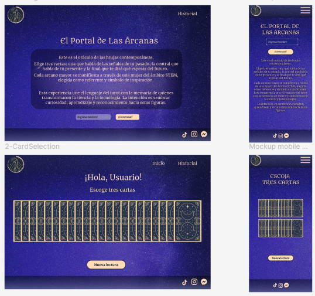

# 🔮 Contemporary Goddesses Tarot

A virtual tarot that reveals your past, present, and future — each card linked to a contemporary woman in STEM.
Our goal is to honor and highlight women who are leading and innovating in fields that have traditionally been male-dominated.

## 🔍 Sneak Peek



## 🧠 How It Works

Users can:

- ✅ See all the cards face down (shuffled)  
- ✅ Select three cards (past, present, and future)  
- ✅ Reveal the meaning of each card  
- ✅ Learn about the contemporary goddess associated with each card  
- ✅ Save their readings in a history (with name and date)  
- ✅ Edit saved readings  
- ✅ Delete specific readings or clear the entire history  

## How to use it:

## 🚀 How to Run the Project Locally

```bash
# 1. Clone the repository
git clone https://github.com/surayac/P5-Contemporary-goddesses-tarot

# 2. Move into the project directory
cd P5-Contemporary-goddesses-tarot

# 3. Install the dependencies
npm install

# 4. Start the development server
npm run dev

# 5. In another terminal tab, start the local JSON Server
npx json-server --watch src/assets/data/db.json --port 3001

```

## ⚙️ Tech Stack

| Technology       | Version    | Description                  |
|------------------|------------|------------------------------|
| React.js         | 19.1.0     | UI framework                 |
| Vite             | 7.1.3      | Build tool                   |
| Tailwind CSS     | 4.1.12     | Utility-first CSS framework  |
| JavaScript (ES6) | –          | Logic                        |
| HTML5 & CSS3     | –          | Markup and styling           |
| Axios            | 1.11.0     | HTTP requests                |
| Json-server      | 1.0.0-B3   | Local REST API               |
| Vitest           | 1.4.0      | Unit testing framework       |


## 🛠 Tools

Figma → UI design with Atomic Design

Postman → endpoint testing

Trello → project organization

Git & GitHub → version control

## 📡 API Endpoints

Get all cards:
https://6872278c76a5723aacd3cbb3.mockapi.io/api/v1/tarot

Get card by ID:
https://6872278c76a5723aacd3cbb3.mockapi.io/api/v1/tarot/:id

## 👥 The Team

This project was developed by:

[Erika P. Montoya](https://github.com/DevErika) → Product Owner & Developer

[Daniella Pacheco](https://github.com/DaniPacheco8) → Scrum Master & Developer

[Estefania Secanell](https://github.com/Abaraira) → Developer

[Suraya Souto](https://github.com/surayac) → Developer

[Jashaira Azañedo](https://github.com/JMileny89) → Developer
